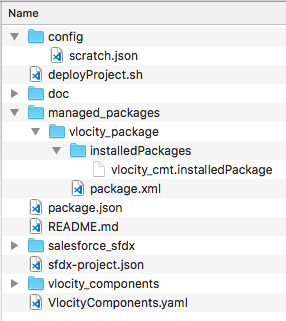
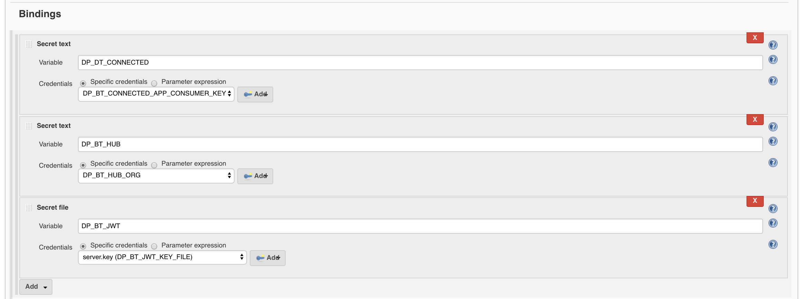
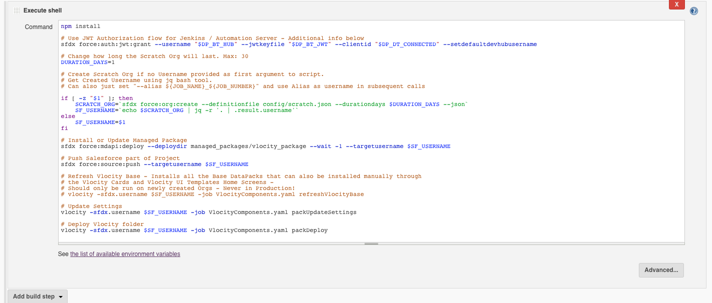
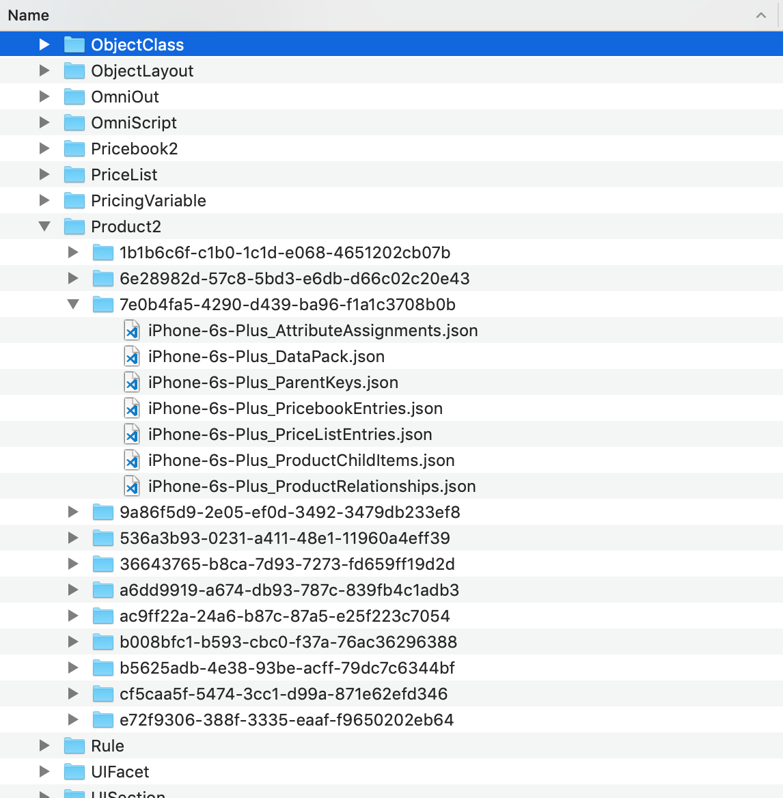
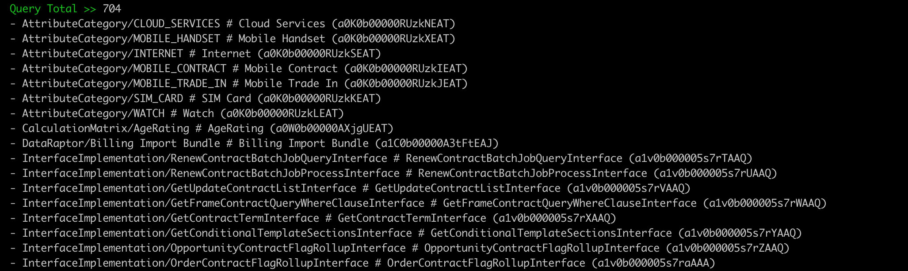
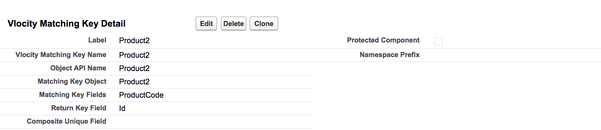
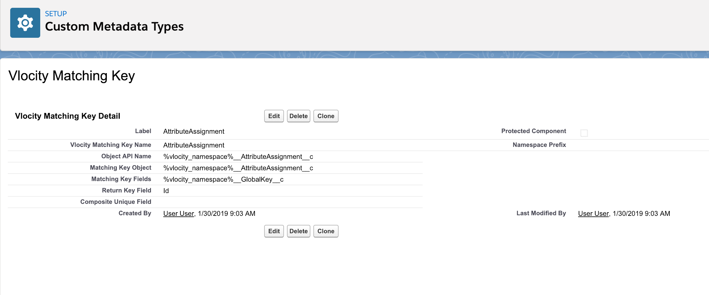
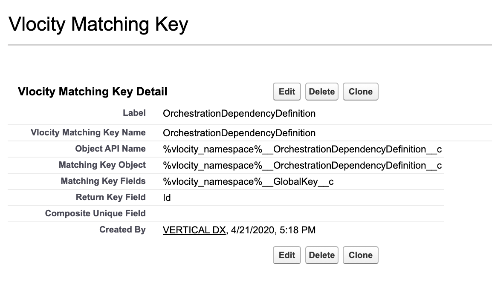

# Vlocity Build
Vlocity Build is a command line tool to export and deploy Vlocity DataPacks in a source control friendly format through a YAML Manifest describing your project. Its primary goal is to enable Continuous Integration for Vlocity Metadata through source control. It is written as a Node.js Command Line Tool.

- [Vlocity Build](#vlocity-build)
 - [Recent Features](#recent-features)
 	- [v1.11 - Clean Org Data Automation Improved, Fix Install / Refresh Vlocity Base Errors, Better Handling for Missing Matching Key Type References](#v111---clean-org-data-automation-improved-embedded-omniscript-full-fix-fix-install--refresh-vlocity-base-errors-better-handling-for-missing-matching-key-type-references)
 		- [Clean Org Data Automation Improved](#clean-org-data-automation-improved)
 		- [Fix Install / Refresh Vlocity Base Errors](#fix-install--refresh-vlocity-base-errors)
 		- [Better Handling for Missing Matching Key Type References](#better-handling-for-missing-matching-key-type-references)
 	- [v1.10 - Auto Fix Duplicate Attribute Category Sequence, Improve Clean Org Data to report actual duplicates based on DataPack Metadata, Fix Reusable OmniScripts, Fix OmniScript Issue when two Elements had the Same Name with Different Case, Change Deployment Strategy to fix potential Concurrency issues](#v110---auto-fix-duplicate-attribute-category-sequence-improve-clean-org-data-to-report-actual-duplicates-based-on-datapack-metadata-fix-reusable-omniscripts-fix-omniscript-issue-when-two-elements-had-the-same-name-with-different-case-change-deployment-strategy-to-fix-potential-concurrency-issues)
 		- [Auto Fix Duplicate Attribute Category Sequence](#auto-fix-duplicate-attribute-category-sequence)
 		- [Improve Clean Org Data to report actual duplicates based on DataPack Metadata](#improve-clean-org-data-to-report-actual-duplicates-based-on-datapack-metadata)
 		- [Fix Reusable OmniScripts embedded in multiple other OmniScripts from failing Activation](#fix-reusable-omniscripts-embedded-in-multiple-other-omniscripts-from-failing-activation)
 		- [Fix OmniScript Issue when two Elements had the Same Name with Different Case](#fix-omniscript-issue-when-two-elements-had-the-same-name-with-different-case)
 		- [Change Deployment Strategy to fix potential Concurrency issues](#change-deployment-strategy-to-fix-potential-concurrency-issues)
 	- [v1.9 - Auto Update Restricted Picklists, Support for Large Matrix and OmniScripts, Auto Re-Activate OmniScripts with Embedded Templates, Auto Retry, Stale References Check, Performance Enhancements](#v19---auto-update-restricted-picklists-support-for-large-matrix-and-omniscripts-auto-re-activate-omniscripts-with-embedded-templates-auto-retry-stale-references-check-performance-enhancements)
 		- [Auto Update Restricted Picklists](#auto-update-restricted-picklists)
 		- [Support for Large Calculation Matrix and OmniScripts](#support-for-large-calculation-matrix-and-omniscripts) 
 		- [Auto Re-Activate OmniScripts with Embedded Templates](#auto-re-activate-omniscripts-with-embedded-templates) 
 		- [Auto Retry](#auto-retry) 
 		- [Stale References Check](#stale-references-check) 
 		- [VlocityUITemplate SCSS Includes now Auto Export](#vlocityuitemplate-scss-includes-now-auto-export) 
 		- [Performance Enhancements](#performance-enhancements) 
 		- [Global Key Changes](#global-key-changes) 
 	- [v1.8 - Delta Deploys / Exports, Error Message Enhancements, Git Changes Based Deploys, and Auto Update Settings](#v18---delta-deploys--exports-error-message-enhancements-git-changes-based-deploys-and-auto-update-settings) 
 		- [Delta Deploys / Exports](#delta-deploys--exports) 
 		- [Error Message Enhancements](#error-message-enhancements) 
 				- [Previous:](#previous) 
 				- [New:](#new) 
 		- [Git Changes Based Deploys](#git-changes-based-deploys) 
 		- [Auto Update Settings](#auto-update-settings) 
 	- [v1.7](#v17) 
 		- [OmniScript and IntegrationProcedure](#omniscript-and-integrationprocedure) 
 		- [SFDX](#sfdx) 
 - [Recent Data Model Changes](#recent-data-model-changes) 
 	- [v1.8 - No Changes](#v18---no-changes) 
 	- [v1.7 - OmniScript and IntegrationProcedure](#v17---omniscript-and-integrationprocedure) 
 	- [v1.6 - Enterprise Product Catalog - Product2, Pricebook and PriceList](#v16---enterprise-product-catalog---product2-pricebook-and-pricelist) 
 	- [Rolling Back Changes to the Vlocity Build Tool](#rolling-back-changes-to-the-vlocity-build-tool) 
 - [Installation and Update Instructions](#installation-and-update-instructions) 
 	- [Install Node.js](#install-nodejs) 
 	- [Install or Update Vlocity Build through NPM](#install-or-update-vlocity-build-through-npm) 
 	- [Releases](#releases) 
 		- [Installing Older Releases](#installing-older-releases) 
 		- [Cloning Vlocity Build - Not Recommended](#cloning-vlocity-build---not-recommended) 
 - [Getting Started](#getting-started) 
 	- [Running the Process](#running-the-process) 
 	- [Property File](#property-file) 
 	- [Job File](#job-file) 
 - [Step by Step Guide](#step-by-step-guide) 
 	- [Simple Export](#simple-export) 
 	- [Simple Deploy](#simple-deploy) 
 	- [Org to Org Migration](#org-to-org-migration) 
 		- [Summary of Org to Org Migration](#summary-of-org-to-org-migration) 
 		- [New Sandbox Orgs](#new-sandbox-orgs) 
 - [Automation Quick Guide](#automation-quick-guide) 
 	- [Vlocity Build + Salesforce DX](#vlocity-build--salesforce-dx) 
 		- [Vlocity Managed Package](#vlocity-managed-package) 
 	- [Running in Jenkins](#running-in-jenkins) 
 - [The Job File](#the-job-file) 
 	- [What will be Exported?](#what-will-be-exported) 
 	- [Example Job File](#example-job-file) 
 			- [dataPacksJobs/Example.yaml](#datapacksjobsexampleyaml) 
 	- [Predefined vs Explicit Queries](#predefined-vs-explicit-queries) 
 	- [Query All](#query-all) 
 - [Troubleshooting](#troubleshooting) 
 	- [Log Files](#log-files) 
 	- [Data Quality](#data-quality) 
 	- [Errors](#errors) 
 		- [Not Found](#not-found) 
 		- [No Match Found](#no-match-found) 
 		- [SASS Compilation Error](#sass-compilation-error) 
 		- [Validation Errors](#validation-errors) 
 		- [Duplicate Value Found](#duplicate-value-found) 
 		- [Multiple Imported Records will incorrectly create the same Salesforce Record](#multiple-imported-records-will-incorrectly-create-the-same-salesforce-record) 
 		- [Some records were not processed](#some-records-were-not-processed) 
 	- [Cleaning Bad Data](#cleaning-bad-data) 
 	- [External Ids and Global Keys](#external-ids-and-global-keys) 
 	- [Validation](#validation) 
 - [All Commands](#all-commands) 
 	- [Primary](#primary) 
 	- [Troubleshooting](#troubleshooting-1) 
 	- [Additional](#additional) 
 	- [Example Commands](#example-commands) 
 		- [packExport](#packexport) 
 		- [packExportSingle](#packexportsingle) 
 		- [packExportAllDefault](#packexportalldefault) 
 		- [packDeploy](#packdeploy) 
 		- [cleanOrgData](#cleanorgdata) 
 		- [validateLocalData](#validatelocaldata) 
 		- [refreshProject](#refreshproject) 
 		- [packContinue](#packcontinue) 
 		- [packRetry](#packretry) 
 		- [packGetDiffs](#packgetdiffs) 
 		- [packGetDiffsAndDeploy](#packgetdiffsanddeploy) 
 - [Additional Command Line Options](#additional-command-line-options) 
 	- [Job Options](#job-options) 
 	- [Vlocity Build Options](#vlocity-build-options) 
 - [Developer Workflow](#developer-workflow) 
 	- [Manifest Driven Workflow](#manifest-driven-workflow) 
 		- [VlocityDataPackKey Overview](#vlocitydatapackkey-overview) 
 		- [Using the VlocityDataPackKey in the Manifest](#using-the-vlocitydatapackkey-in-the-manifest) 
 		- [Adding to Job Files](#adding-to-job-files) 
 			- [Export Job File](#export-job-file) 
 			- [Deploy Job File](#deploy-job-file) 
 - [Other Job File Settings](#other-job-file-settings) 
 	- [Basic](#basic) 
 	- [Export](#export) 
 	- [Export by Queries](#export-by-queries) 
 	- [Export Results](#export-results) 
 	- [Advanced: Export by Manifest](#advanced-export-by-manifest) 
 	- [Advanced: Export Individual SObject Records](#advanced-export-individual-sobject-records) 
 	- [BuildFile](#buildfile) 
 	- [Anonymous Apex](#anonymous-apex) 
 - [Supported DataPack Types](#supported-datapack-types) 
 - [Advanced](#advanced) 
 	- [Anonymous Apex and JavaScript](#anonymous-apex-and-javascript) 
 		- [Namespace](#namespace) 
 		- [Loading Apex Code](#loading-apex-code) 
 		- [BaseUtilities.cls](#baseutilitiescls) 
 		- [PreJobApex](#prejobapex) 
 		- [preJobApex vs preStepApex](#prejobapex-vs-prestepapex) 
 			- [Pre and Post Job JavaScript](#pre-and-post-job-javascript) 
 				- [Export by Queries](#export-by-queries-1) 
 				- [Deploy](#deploy) 
 			- [PostJobApex Replacement Format](#postjobapex-replacement-format) 
 				- [Deploy](#deploy-1) 
 	- [Matching Keys](#matching-keys) 
 		- [Creating Custom Matching Keys](#creating-custom-matching-keys) 
 		- [Current Matching Keys](#current-matching-keys) 
 		- [CLI API](#cli-api) 
 		- [Overriding DataPack Settings](#overriding-datapack-settings) 
 - [OmniOut](#omniout) 
 - [Known Issues](#known-issues) 

# Recent Features

## v1.11 - Clean Org Data Automation Improved, Embedded OmniScript full Fix, Fix Install / Refresh Vlocity Base Errors, Better Handling for Missing Matching Key Type References

### Clean Org Data Automation Improved
CleanOrgData now queries for a larger set of records and will fix Duplicate Global Keys Automatically in your org when possible.

### Fix Install / Refresh Vlocity Base Errors
When refreshVlocityBase or installVlocityInitial encountered errors it would kill the whole process. It now better handles these errors and installs all the DataPacks that did not fail.

### Better Handling for Missing Matching Key Type References
If an Id is being moved from one environment to another and No Matching Key exists for its type, the Id will be automatically ignored as it was guaranteed to fail.

## v1.10 - Auto Fix Duplicate Attribute Category Sequence, Improve Clean Org Data to report actual duplicates based on DataPack Metadata, Fix Reusable OmniScripts, Fix OmniScript Issue when two Elements had the Same Name with Different Case, Change Deployment Strategy to fix potential Concurrency issues

### Auto Fix Duplicate Attribute Category Sequence
Fix for Attribute Categories that have the same Sequence automatically during the deployment.

### Improve Clean Org Data to report actual duplicates based on DataPack Metadata
Now uses Matching Keys to accurately report the Duplicates instead of only reporting the ones with duplicate Global Keys.

### Fix Reusable OmniScripts embedded in multiple other OmniScripts from failing Activation
Previously if activating a Reusable OmniScript caused too many other OmniScripts to activate it would fail. *Note:* This requires that you are logged in via [SFDX Authentication](#getting-started). *Was Previously reported to have been fixed in v1.9, but there was an error preventing the actual changes to be reflected if made to the Reusable OmniScript.*

### Fix OmniScript Issue when two Elements had the Same Name with Different Case
Previously one of the OmniScript Elements would disappear when deployed.

### Change Deployment Strategy to fix potential Concurrency issues
Changes to deployment to make it remove some parallel processing.

## v1.9 - Auto Update Restricted Picklists, Support for Large Matrix and OmniScripts, Auto Re-Activate OmniScripts with Embedded Templates, Auto Retry, Stale References Check, Performance Enhancements
### Auto Update Restricted Picklists
By default the Vlocity Build Tool will automatically add Restricted Picklist values to the fields that are being deployed to. This makes metadata changes across orgs for Vlocity Managed Package fields automatically propagate and eliminates errors due to this missing metadata. To turn off this feature add `autoFixPicklists: false` to your Job File. Does not work for Managed Global Value Sets - Like Vlocity's CurrencyCode field.

### Support for Large Calculation Matrix and OmniScripts
Large Calculation Matrix which would take a long time to deploy and OmniScripts which could previously fail due to heap size issues, will now be deployed through Salesforce Bulk Uploads to eliminate potential issues.

### Auto Re-Activate OmniScripts with Embedded Templates
When VlocityUITemplates that can be embedded in OmniScripts are deployed you now have the option of enabling a job that will reactivate all currently active OmniScripts post deploy. To enable this feature add `reactivateOmniScriptsWhenEmbeddedTemplateFound: true`. *Note:* This will run activate for all OmniScripts and for now requires that you are logged in via [SFDX Authentication](#getting-started).

### Auto Retry
Auto Retry will enable the Vlocity Build Tool to retry errors which may have been caused by incorrect deploy order or transient issues. Add `autoRetryErrors: true` to your Job File.

### Stale References Check
Use the new command `vlocity checkStaleObjects` to ensure that all references in your project exist in either the org or locally. This is meant to ensure that you will see any missing reference errors before your deployment.

### VlocityUITemplate SCSS Includes now Auto Export
When another VlocityUITemplate includes references to a SCSS Mixin or Variables VlocityUITemplate it will automatically be exported as a dependency. 

### Performance Enhancements
Elimination of a wasteful file writing process and more reliance on Node Async Processing will improve performance for larger projects.

### Global Key Changes
AttributeCategory__c, CalculationMatrixVersion__c, CalculationMatrix__c, CalculationProcedureVersion__c, CalculationProcedure__c, DRBundle__c now use their unique field of Name or Code as the GlobalKey__c field.

## v1.8 - Delta Deploys / Exports, Error Message Enhancements, Git Changes Based Deploys, and Auto Update Settings   
### Delta Deploys / Exports
Add `deltaCheck: true` to your job file to enable checking to see if there are changes to the items you are about to deploy or export. This check will run much faster than the getDiffsAndDeploy check, but at this time 100% consistency is not guaranteed for all DataPack Types. The checks will error on the side of caution and run the deploy /export automatically for any DataPack Type that may have changes.

### Error Message Enhancements
Error messages have been improved to give more instruction on how to fix issues. An example change is as follows:

##### Previous:
`Error >> AttributeCategory/ATTRIBUTE_CATEGORY --- ATTRIBUTE_CATEGORY --- duplicate value found: <unknown> duplicates value on record with id: <unknown>`

##### New:
`Error >> AttributeCategory/ATTRIBUTE_CATEGORY -- DataPack >> ATTRIBUTE_CATEGORY -- Error Message --  duplicate field value found: 100 on the field: vlocity_cmt__DisplaySequence__c on record with id: a0K0b00000XabWUEAZ -- Change the vlocity_cmt__DisplaySequence__c field value of the vlocity_cmt__AttributeCategory__c on record with id: a0K0b00000XabWUEAZ in the target org to resolve the issue.`

### Git Changes Based Deploys
Add `gitCheck: true` to your job file to enable checking what the latest git hash was before deploying to the target org. With this setting *only* the DataPacks that have changed between the previous git hash and the latest git hash will be deployed to the org. Add the key `gitCheckKey: Folder1` to your individual Job Files if you have more than one folder in your repo that contains DataPacks.

### Auto Update Settings
Add `autoUpdateSettings: true` to your job file to enable checking that you have the latest DataPack settings before every export and deploy. This check is very fast and it is advised that this is enabled. 

## v1.7
### OmniScript and IntegrationProcedure
The OmniScript and IntegrationProcedure DataPacks have been modified to remove the Order and Level. This means that merging changes for these objects is now much easier.

### SFDX
Authentication with Salesforce DX credentials is now possible. Use `-sfdx.username` to use a Salesforce DX Authorized Org for `vlocity` commands. Once you are passing this parameter you will not need a password or any other propertyfile information. The Salesforce DX Authorization from `sfdx force:org:display -u <username>` will handle all the information. Passing an alias will work as well.

# Recent Data Model Changes

## v1.8 - No Changes
There were no data model changes for v1.8

## v1.7 - OmniScript and IntegrationProcedure
The OmniScript and IntegrationProcedure DataPacks have been modified to remove the Order and Level fields which previously controlled how the OmniScript Elements were ordered in the UI. Now the Elements__c Array in the OmniScript `_DataPack.json` file is ordered in the display order of the UI.

This change will affect any newly exported OmniScript and IntegrationProcedure, and all files in the newly exported DataPacks should be committed to version control. 

This change can be applied to all OmniScripts and IntegrationProcedures immediately by running the `refreshProject` command. 

All existing data is still compatible, and issues will only arise when an OmniScript or IntegrationProcedure exported with Vlocity Build 1.7+ is deployed with an earlier version of the Vlocity Build Tool. 

Please ensure everyone on your project is using the same version of this build tool.

## v1.6 - Enterprise Product Catalog - Product2, Pricebook and PriceList 
The Product2 DataPack has been modified to include all Pricebook and PriceList Entries for the Product. This means that a Product can be migrated from one org to another along with its Pricing Information without migrating the other Products in the Pricebook and Price List. 

Running `packUpdateSettings` and re-exporting the Product2, Pricebook and PriceList is necessary to migrate to the new format, however existing data should still be deployable with the new changes.

# Installation and Update Instructions

## Install Node.js
Download and Install Node at:

https://nodejs.org/

This tool requires Node Version 10+.

Use `node -v` to find out which version you are on.

## Install or Update Vlocity Build through NPM
You can install or update this package like any other Node Package! *Do not clone the repo!*
```bash
npm install --global vlocity
vlocity help
```

This should show a list of all available commands confirming that the project has been installed or updated successfully. You can now run this command from any folder.

## Releases
All releases for this Project can be found at:
https://github.com/vlocityinc/vlocity_build/releases

Each release includes a Binary for:  
Linux  
MacOS  
Windows x64  
Windows x86  

### Installing Older Release Versions
To Install an Older Version of the Vlocity Build Tool use the following NPM command for installing by version:
```bash
npm install --global vlocity@1.9.1
vlocity help
```

Only if you need to install a version before v1.7 use the following syntax:
```bash
npm install --global https://github.com/vlocityinc/vlocity_build#v1.5.7
vlocity help
```


### Cloning Vlocity Build - Not Recommended
It is no longer advised to clone the Vlocity Build Repository directly. If you have previously cloned the Vlocity Build Project and are having issues with the alias `vlocity` still being used as the cloned project, please use the following command in the cloned `vlocity_build` folder:
```bash
npm unlink .
```
If you would like to use the Vlocity Build Project from its Source, please use the following command in the cloned `vlocity_build` folder:
```bash
npm link
npm install
```

# Getting Started

If you are using Salesforce DX, you can use `-sfdx.username` to use a Salesforce DX Authorized Org for authentication. The Vlocity Build Tool will use the Salesforce DX information from `sfdx force:org:display -u <username or alias>`. This can be a Scratch Org, or one Authorized through `sfdx force:auth:web:login`.

Otherwise, create your own property files for your Source and Target Salesforce Orgs with the following:
```java
sf.username = < Salesforce Username >
sf.password = < Salesforce Password + Security Token >
sf.loginUrl = < https://login.salesforce.com or https://test.salesforce.com for Sandbox >
```
When you (or your CI/CD server) is behind a proxy you can specify the proxy URL with a Username and password by adding the following line to your property file:
```java
sf.httpProxy: http://[<Proxy server Username>:<Proxy server Password>@]<Proxy hostname>[:<Proxy Port>]
```

Additionally there is support for OAuth style information sent through the command line or property file:
```bash
vlocity packExport -sf.authToken <authToken> -sf.instanceUrl <instanceUrl> -sf.sessionId <sessionId>
```

It is best to not rely on a single build.properties file and instead use named properties files for each org like `build_source.properties` and `build_target.properties`

## Running the Process
Commands follow the syntax:
```bash
vlocity packExport -propertyfile <filepath> -job <filepath>
```
## Property File
The propertyfile is used to provide the credentials of the org you will connect to. It will default to build.properties if no file is specified.

## Job File
The Job File used to define the project location and the various settings for running a DataPacks Export / Deploy.

# Step by Step Guide
Once you have your `build_source.properties` file setup, you can get started with migration with the following: 

## Simple Export
Example.yaml shows the most Simple Job File that can be used to setup a project:
```yaml
projectPath: ./example_vlocity_build 
queries: 
  - VlocityDataPackType: DataRaptor 
    query: Select Id from %vlocity_namespace%__DRBundle__c where Name = 'DataRaptor Migration' LIMIT 1
```

Run the following command to export this Job File:
```bash
vlocity -propertyfile build_source.properties -job dataPacksJobs/Example.yaml packExport
```

Which will produce the following output:
```
Salesforce Org >> source_org@vlocity.com  
VlocityDataPackType >> DataRaptor  
Query >> Select Id from vlocity_cmt__DRBundle__c where Name = 'DataRaptor Migration' LIMIT 1  
Records >> 1  
Query Total >> 1  
Initializing Project  
Exporting >> DataRaptor a191N000012pxsYQAQ  
Creating file >> example_vlocity_build/DataRaptor/DataRaptor-Migration/DataRaptor-Migration_DataPack.json  
Salesforce Org >> source_org@vlocity.com   
Current Status >> Export    
Successful >> 1  
Errors >> 0  
Remaining >> 0  
Elapsed Time >> 0m 5s  
Salesforce Org >> source_org@vlocity.com    
Export success:  
1 Completed  
```

This has exported data from the org specified in your `build_source.properties` file and written it to the folder `example_vlocity_build` specified in the `Example.yaml` file found at `dataPacksJobs/Example.yaml`

## Simple Deploy
To deploy the data you just exported run the following command:  
```bash
vlocity -propertyfile build_target.properties -job Example.yaml packDeploy
```

Which will produce the following output:
```
Salesforce Org >> target_org@vlocity.com  
Current Status >> Deploy   
Adding to Deploy >> DataRaptor/DataRaptor Migration - DataRaptor-Migration
Deploy Success >> DataRaptor/DataRaptor Migration - DataRaptor-Migration
Salesforce Org >> target_org@vlocity.com   
Current Status >> Deploy    
Successful >> 1  
Errors >> 0  
Remaining >> 0  
Elapsed Time >> 0m 4s  
Salesforce Org >> target_org@vlocity.com   
```
## Org to Org Migration
When Exporting and Deploying between two Orgs use the following action plan:  
1. Create Property Files for each Org. `build_source.properties` and `build_target.properties`  
2. Create a Job File which identifies your projectPath and the queries for the DataPack Types you would like to export. To export the Vlocity Product Catalog, use the following EPC.yaml file:
```yaml
projectPath: vlocity
queries:
  - AttributeCategory
  - CalculationProcedure
  - ContextAction
  - ContextDimension
  - ContextScope
  - EntityFilter
  - ObjectClass
  - ObjectContextRule
  - ObjectLayout
  - Pricebook2
  - PriceList
  - PricingVariable
  - Product2
  - Promotion
  - Rule
  - TimePlan
  - TimePolicy
  - UIFacet
  - UISection
  - VlocityFunction
  - VlocityPicklist
```
3. Ensure High Data Quality in the Source Org by running:   
`vlocity -propertyfile build_source.properties -job EPC.yaml cleanOrgData`  
4. Update your DataPack Settings in the source Org to the latest in the Vlocity Build Tool by running:  
`vlocity -propertyfile build_source.properties -job EPC.yaml packUpdateSettings`  
This step will deliver changes to the DataPack settings outside the Vlocity Managed Package installation flow and should be run after upgrading/installing the package or on new Sandbox orgs.  
5. Run the Export:  
`vlocity -propertyfile build_source.properties -job EPC.yaml packExport`  
6. If you encounter any Errors during Export please evaluate their importance. Any error during export points to potential errors during deploy. See the [troubleshooting](#troubleshooting) section of this document for more details on fixing errors. Once errors are fixed, run the following to re-export any failed data:  
`vlocity -propertyfile build_source.properties -job EPC.yaml packRetry`  
If your Export fails midway through due to connection issues, you can also use the following to pick the export back up where it left off:  
`vlocity -propertyfile build_source.properties -job EPC.yaml packContinue` 
7. Check the Exported Data for Potential Issues:  
`vlocity -propertyfile build_source.properties -job EPC.yaml validateLocalData`  
This will give a summary of Duplicate and Missing Global Keys. Use the argument `--fixLocalGlobalKeys` to automatically add missing and change duplicate keys. However it is generally better to fix the data in the Org itself.
8. Ensure High Data Quality in the Target Org by running:  
`vlocity -propertyfile build_target.properties -job EPC.yaml cleanOrgData`  
9. Ensure your Vlocity Metadata is high quality by running:  
`vlocity -propertyfile build_target.properties -job EPC.yaml refreshProject` 
This command helps fix any broken references in the project.  
10. Update the DataPack Settings in the Target Org:  
`vlocity -propertyfile build_target.properties -job EPC.yaml packUpdateSettings`
11. Run the deploy:  
`vlocity -propertyfile build_target.properties -job EPC.yaml packDeploy`
12. If you encounter any Errors during deploy they must be fixed. But first, evaluate whether the error has been mitigated by later uploads of missing data. Run:  
`vlocity -propertyfile build_target.properties -job EPC.yaml packRetry`  
Which will retry the failed DataPacks, often fixing errors due to issues in the order of deploy or Salesforce Governor limits. `packRetry` should be run until the error count stops going down after each run. See the [troubleshooting](#troubleshooting) section of this document for more details on fixing errors.

### Summary of Org to Org Migration
All together the commands are:
```bash
# Source Org
vlocity -propertyfile build_source.properties -job EPC.yaml cleanOrgData
vlocity -propertyfile build_source.properties -job EPC.yaml packUpdateSettings
vlocity -propertyfile build_source.properties -job EPC.yaml packExport
vlocity -propertyfile build_source.properties -job EPC.yaml packRetry # If any errors
vlocity -propertyfile build_source.properties -job EPC.yaml validateLocalData

# Target Org
vlocity -propertyfile build_target.properties -job EPC.yaml cleanOrgData
vlocity -propertyfile build_target.properties -job EPC.yaml refreshProject
vlocity -propertyfile build_target.properties -job EPC.yaml packUpdateSettings
vlocity -propertyfile build_target.properties -job EPC.yaml packDeploy
vlocity -propertyfile build_target.properties -job EPC.yaml packRetry # If any errors
```

### New Sandbox Orgs
If you have recently installed the Vlocity Managed Package or created a Sandbox Org that is not a Full Copy Sandbox and have done *no* development this Salesforce Org, you should run the following command to load all the default Vlocity Metadata:
```bash
vlocity -propertyfile build_target.properties --nojob packUpdateSettings installVlocityInitial
```
This will install the Base UI Templates, CPQ Base Templates, EPC Default Objects and any other default data delivered through Vlocity DataPacks. This command should only be run if the Org was not previously used for Vlocity Development.

# Automation Quick Guide

## Vlocity Build + Salesforce DX

Vlocity Build is meant to fit seamlessly into an Automated Salesforce Build.

A simple Project could look like:  


Which includes Vlocity DataPacks in `vlocity_components` folder and a Salesforce DX Project in the `salesforce_sfdx` folder. 

A Shell script with Salesforce DX and Vlocity Build would have the following:
```bash
# Use JWT Authorization flow for Jenkins / Automation Server - Additional info below
sfdx force:auth:jwt:grant --username "$DP_BT_HUB" --jwtkeyfile "$DP_BT_JWT" --clientid "$DP_DT_CONNECTED" --setdefaultdevhubusername

# Change how long the Scratch Org will last. Max: 30
DURATION_DAYS=1

# Create Scratch Org if no Username provided as first argument to script. 
# Get Created Username using jq bash tool. 
# Can also just set "--alias ${JOB_NAME}_${JOB_NUMBER}" and use Alias as username in subsequent calls

if [ -z "$1" ]; then
    SCRATCH_ORG=`sfdx force:org:create --definitionfile config/scratch.json --durationdays $DURATION_DAYS --json`
    SF_USERNAME=`echo $SCRATCH_ORG | jq -r '. | .result.username'`
else 
    SF_USERNAME=$1
fi

# Install or Update Managed Package
sfdx force:mdapi:deploy --deploydir managed_packages/vlocity_package --wait -1 --targetusername $SF_USERNAME

# Push Salesforce part of Project
sfdx force:source:push --targetusername $SF_USERNAME

# Refresh Vlocity Base - Installs all the Vlocity Authored Vlocity Cards and Vlocity UI Templates
vlocity -sfdx.username $SF_USERNAME -job VlocityComponents.yaml refreshVlocityBase

# Update Settings
vlocity -sfdx.username $SF_USERNAME -job VlocityComponents.yaml packUpdateSettings

# Deploy Vlocity folder
vlocity -sfdx.username $SF_USERNAME -job VlocityComponents.yaml packDeploy
```

### Vlocity Managed Package
The managed package in the example is installed through the Metadata API with `sfdx`. It is stored at the path `managed_packages/vlocity_package/installedPackages/vlocity_cmt.installedPackage`. The version of the package installed can be updated in this file.

```xml
<InstalledPackage xmlns="http://soap.sforce.com/2006/04/metadata">
    <versionNumber>900.208.0</versionNumber>
</InstalledPackage>
```

## Running in Jenkins
In order to run `sfdx` in Jenkins (or any server) you must setup [JWT Authorization.](https://developer.salesforce.com/docs/atlas.en-us.sfdx_dev.meta/sfdx_dev/sfdx_dev_auth_jwt_flow.htm)

Salesforce additionally provides a [Trailhead for Travis CI](https://trailhead.salesforce.com/modules/sfdx_travis_ci/units/sfdx_travis_ci_connected_app)

The first step of setting up Jenkins for this project is adding the JWT Bindings:


Then adding the build step:


# The Job File
A Job File is similar to a Salesforce package.xml file, however it also includes runtime options like the maximum number of concurrent API calls running.  

**The Default Job Settings will automatically be used if not explicitly specified in your file, and it is best to not add settings to the file unless you want to change them from the defaults.**

The Job File's primary settings that you should define is specifying the folder that you would like to use to contain your project.
```yaml
projectPath: ../myprojectPath 
```

The projectPath can be the absolute path to a folder or the relative path from where you run the vlocity command.  

## What will be Exported?
By default, all data will be exported from the org when running the `packExport` command. To narrow the exported data, you can define any Salesforce SOQL query that returns the Id of records you would like to export.
```yaml
queries:
  - VlocityDataPackType: DataRaptor
    query: Select Id from %vlocity_namespace%__DRBundle__c where Name LIKE '%Migration' LIMIT 1
```

This query will export a DataRaptor Vlocity DataPack by querying the SObject table for DataRaptor `DRBundle__c` and even supports the `LIMIT 1` and `LIKE` syntax. 

## Example Job File
#### dataPacksJobs/Example.yaml  
```yaml
projectPath: ./example_vlocity_build 
queries: 
  - VlocityDataPackType: DataRaptor 
    query: Select Id from %vlocity_namespace%__DRBundle__c LIMIT 1
```

When creating your own Job File, the **only** setting that is very important is the projectPath which specifies where the DataPacks files will be written.

All other settings will use the Default Project Settings.

By Default, all DataPack Types will be Exported when running packExport, so to override the Export data, it is possible to use predefined queries, or write your own.

## Predefined vs Explicit Queries
Vlocity has defined full queries for all Supported DataPack Types which will export all currently Active Vlocity Metadata. **This is the most simple way to define your own Job File queries.**

To Export All DataRaptors and OmniScripts from the Org use:
```yaml
projectPath: ./myprojectPath
queries:
  - DataRaptor
  - OmniScript
```
This predefined syntax is defined in lib/querydefinitions.yaml and will load the following explicit queries:
```yaml
queries:
  - VlocityDataPackType: DataRaptor
    query: Select Id, Name from %vlocity_namespace%__DRBundle__c where %vlocity_namespace%__Type__c != 'Migration'
  - VlocityDataPackType: OmniScript
    query: Select Id, %vlocity_namespace%__Type__c,  %vlocity_namespace%__SubType__c, %vlocity_namespace%__Language__c from %vlocity_namespace%__OmniScript__c where %vlocity_namespace%__IsActive__c
    = true AND %vlocity_namespace%__IsProcedure__c = false
```

The WHERE clauses show that these Queries will Export all DataRaptors that are not internal Vlocity Configuration Data and all Active OmniScripts.

When Exporting, the DataPacks API will additionally export all dependencies of the Vlocity DataPacks which are being exported. So Exporting just the OmniScripts from an Org will also bring in all referenced DataRaptors, VlocityUITemplates, etc, so that the OmniScript will be fully usable once deployed.

## Query All
Running `packExport` with no queries defined in your Job File will export all the predefined queries for each type. If you do have some special queries defined, you can also run: `packExportAllDefault` to specify running all the default queries.

# Troubleshooting

## Log Files
Three log files are generated for every command run.

`VlocityBuildLog.yaml` - This file is a summary of what was executed during the command just run. It will appear in the directory you are running the command.

`VlocityBuildErrors.log` - This file will contain the errors during the job. It will appear in the directory you are running the command. 

`vlocity-temp/logs/<JobName>-<Timestamp>-<Command>.yaml` - This is a saved version of the VlocityBuildLog.yaml in the logs folder for every command run.

## Data Quality
Once Exported it is very important to validate that your data is in state that is ready to be deployed. The Vlocity Build tool primarily relies on unique data in fields across the different objects to prevent duplicate data being uploaded.

## Errors

### Not Found
Generally errors will be due to missing or incorrect references to other objects. 
```
Error >> DataRaptor --- GetProducts --- Not Found
Error >> VlocityUITemplate --- ShowProducts --- Not Found
```

This "VlocityUITemplate --- ShowProducts --- Not Found" error during Export means that something, likely an OmniScript, has a reference to a VlocityUITemplate that is not currently Active or does not exist in the org as a VlocityUITemplate. In some cases the VlocityUITemplate for an OmniScript can actually be included inside the Visualforce Page in which the OmniScript is displayed. In that case, this error can be completely ignored. The DataRaptor Not Found means that likely someone deleted or changed the name of the DataRaptor being referenced without updating the OmniScript using it.

### No Match Found
Errors occurring during Export will likely result in Errors during deploy. But not always. Errors during Deploy will occur when a Salesforce Id reference is not found in the target system:  
`Deploy Error >> Product2/02d3feaf-a390-2f57-a08c-2bfc3f9b7333 --- iPhone --- No match found for vlocity_cmt__ProductChildItem__c.vlocity_cmt__ChildProductId__c - vlocity_cmt__GlobalKey__c=db65c1c5-ada4-7952-6aa5-8a6b2455ea02`

In this Error the Product being deployed is the iPhone with Global Key `02d3feaf-a390-2f57-a08c-2bfc3f9b7333` and the error is stating that one of the Product Child Items could not find the referenced product with Global Key `db65c1c5-ada4-7952-6aa5-8a6b2455ea02`. This means the other Product must also be deployed. 

In the error, after `No match found for` it is signifying a Reference Field on the SObject with the missing data `<SObject>.<FieldName>` or in this example `vlocity_cmt__ProductChildItem__c.vlocity_cmt__ChildProductId__c`. After this it is indicating what Data is in the DataPack's saved reference: `vlocity_cmt__GlobalKey__c=db65c1c5-ada4-7952-6aa5-8a6b2455ea02`. This is the Global Key of the Product2 being referenced by the field `ChildProductId__c` on the SObject `ProductChildItem__c`. If it is clear that the referenced data does exist, in this case a Product2 with `vlocity_cmt__GlobalKey__c=db65c1c5-ada4-7952-6aa5-8a6b2455ea02`, make sure that the Matching Key for this SObject type is correctly aligned between your two environments. 

### SASS Compilation Error
```
SASS Compilation Error VlocityUITemplate/cpq-total-card Failed to compile SCSS: .\VlocityUITemplate\cpq-total-card\cpq-total-card.scss SASS compilation failed, see error message for details: Error: 
on line 2 of /stdin 
>> @import "cpq-theme-variables";
```
When SASS Fails to compile the issue is generally related to the export not including VlocityUITemplates that are referenced as part of the SASS compilation. Export the missing data with the command:
`vlocity -job <JobFile> packExport -key cpq-theme-variables`

### Validation Errors
Deploys will run all of the Triggers associated with Objects during their import. As there are various rules across the Vlocity Data Model, sometimes errors will occur due to attempts to create what is considered "bad data". These issues must be fixed on a case by case basis.

Some errors are related to potential data quality issues:
`Product2/adac7afa-f741-80dd-9a69-f8a5aa61eb56 >> IPhone Charger - Error - Product you are trying to add is missing a Pricebook Entry in pricebook >>2018 Pricebook<< Please add product to pricebook and try again`

While not clear from the wording, this error indicates that one of the Child Products being added to this Product will potentially cause issues because the Child Product is not in the 2018 Pricebook. To workaround this issue it is most simple to disable temporarily disable the listed Pricebook. This error is generally caused by a cascading failure and can also be solved by deploying the listed pricebook on its own with the command:

`vlocity packDeploy -manifest '["Pricebook2/2018 Pricebook"]'`

### Duplicate Value Found
Some errors are related to conflicting data. For Attribute Category Display Sequence you will receive the following:

`Error >> AttributeCategory/Product_Attributes --- Product Attributes --- duplicate value found: <unknown> duplicates value on record with id: <unknown>`

This error means that a Unique field on the Object is a duplicate of an existing Unique field value. Unfortunately it does not always provide the actual Id. Update the display sequence value for an existing Attribute Category objects in Target Org.

Records with the same Display Sequence can be found via the SOQL query: 

Select Id, Name from %vlocity_namespace%__AttributeCategory__c 
where %vlocity_namespace%__DisplaySequence__c = %DisplaySequence__c from DataPack.json file%

### Multiple Imported Records will incorrectly create the same Salesforce Record
`Catalog/Data – Datapack >> Data – Error Message – Incorrect Import Data. Multiple Imported Records will incorrectly create the same Salesforce Record. vlocity_cmt__CatalogProductRelationship__c: 20MB Plan`

These errors mean there are duplicates in the data. Multiple records with the same data for `vlocity_cmt__CatalogProductRelationship__c: 20MB Plan` (this is the Name). The Matching Key for a CatalogProductRelationship__c object is `%vlocity_namespace%__CatalogId__c, %vlocity_namespace%__Product2Id__c` (See [Current Matching Keys](#current-matching-keys)). Therefore, this error means that there are two references to the same product inside the same Catalog, which is not allowed. The Duplicates must be removed from the Source Org and Re-Exported.

### Some records were not processed
`Product2/adac7afa-f741-80dd-9a69-f8a5aa61eb56 -- Datapack >> IPhone Charger -- Error Message -- Some records were not processed. Please validate imported data types.`

This error means that during the Deploy some of the Records that exist as part of the DataPack Data were not upserted into Salesforce. This generally means that there is a mismatch between the Configuration Data in the target org compared to the Source Org. Re-running `packUpdateSettings` in both orgs is the best way to solve this issue.

## Cleaning Bad Data
This tool includes a script to help find and eliminate "bad data". It can be run with the following command:
```bash
vlocity -propertyfile <propertyfile> -job <job> cleanOrgData
```

This will run Node.js script that Adds Global Keys to all SObjects missing them, and deletes a number of Stale data records that are missing data to make them useful. 

## External Ids and Global Keys 
Most objects being deployed have a field or set of fields used to find unique records like an External Id in Salesforce. For many Vocity Objects this is the Global Key field. If a Deploy finds 1 object matching the Global Key then it will overwrite that object during deploy. If it finds more than 1 then it will throw an error:  

`Deploy Error >> Product2/02d3feaf-a390-2f57-a08c-2bfc3f9b7333 --- iPhone --- Duplicate Results found for Product2 WHERE vlocity_cmt__GlobalKey__c=02d3feaf-a390-2f57-a08c-2bfc3f9b7333 - Related Ids: 01t1I000001ON3qQAG,01t1I000001ON3xQAG`

This means that Duplicates have been created in the org and the data must be cleaned up. 

While there are protections against missing or duplicate Global Keys the logic is often in triggers which may have at points been switched off, and sometimes applies to data that may have existed before the Vlocity Package was installed. 

You can fix missing GlobalKeys by running the following command which will start a set of Batch Jobs to add Global Keys to any Objects which are missing them:
```bash
vlocity -propertyfile <propertyfile> -job <job> runJavaScript -js cleanData.js
```
This will run Node.js script that Adds Global Keys to all SObjects missing them, and deletes a number of Stale data records that are missing data to make them useful. 

However, when you are attempting to migrate data from one org to another where both orgs have missing GlobalKeys, but existing data that should not be duplicated, a different strategy may need to be used to produce GlobalKeys that match between orgs.

## Validation
Ultimately the best validation for a deploy will be testing the functionality directly in the org. 

After Export the command `validateLocalData` can be used to detect missing and duplicate GlobalKeys in the local files that have been exported. 

Another way to see any very clear potential issues is to see if recently deployed data matches exactly what was just exported. 

You can run the following command to check the current local data against the data that exists in the org you deployed to:
```bash
vlocity -propertyfile build_uat.properties -job Example.yaml packGetDiffs
```

This will provide a list of files that are different locally than in the org. In the future more features will be added to view the actual diffs.

# All Commands

## Primary  
`packExport`: Export from a Salesforce org into a DataPack Directory    
`packExportSingle`: Export a Single DataPack by Id    
`packExportAllDefault`: Export All Default DataPacks as listed in Supported Types Table    
`packDeploy`: Deploy all contents of a DataPacks Directory    

## Troubleshooting 
`packContinue`: Continues a job that failed due to an error  
`packRetry`: Continues a Job retrying all deploy errors or re-running all export queries    
`validateLocalData`:  Check for Missing Global Keys in Data.    
`cleanOrgData`: Run Scripts to Clean Data in the Org and Add Global Keys to SObjects missing them    
`refreshProject`: Refresh the Project's Data to the latest format for this tool    

## Additional 
`packGetDiffsAndDeploy`: Deploy only files that are modified compared to the target Org  
`packGetDiffs`: Find all Diffs in Org Compared to Local Files   
`packBuildFile`: Build a DataPacks Directory into a DataPack file   
`runJavaScript`: Rebuild all DataPacks running JavaScript on each or run a Node.js Script   
`packUpdateSettings`: Refreshes the DataPacks Settings to the version included in this project. Recommended only if you are on the latest Major version of the Vlocity Managed Package  
`runApex`: Runs Anonymous Apex specified in the option -apex at the specified path or in the /apex folder  
`packGetAllAvailableExports`: Get list of all DataPacks that can be exported  
`refreshVlocityBase`: Deploy and Activate the Base Vlocity DataPacks included in the Managed Package  
`installVlocityInitial`: Deploy and Activate the Base Vlocity DataPacks and Configuration DataPacks included in the Managed Package  

## Example Commands

### packExport
`packExport` will retrieve all Vlocity Metadata from the org as Vlocity DataPacks as defined in the Job File and write them to the local file system in a Version Control friendly format.   
```bash
vlocity -propertyfile <filepath> -job <filepath> packExport
```

### packExportSingle
`packExportSingle` will export a single DataPack and all its dependencies. It also supports only exporting the single DataPack with no dependencies by setting the depth.  
```bash
vlocity -propertyfile <filepath> -job <filepath> packExportSingle -type <VlocityDataPackType> -id <Salesforce Id> -depth <Integer>
```

Max Depth is optional and a value of 0 will only export the single DataPack. Max Depth of 1 will export the single DataPack along with its first level dependencies.

### packExportAllDefault
`packExportAllDefault` will retrieve all Vlocity Metadata instead of using the Job File definition.  
```bash
vlocity -propertyfile <filepath> -job <filepath> packExportAllDefault
```

### packDeploy
`packDeploy` will deploy all contents in the projectPath of the Job File to the Salesforce Org.  
```bash
vlocity -propertyfile <filepath> -job <filepath> packDeploy
```

### cleanOrgData
`cleanOrgData` will find and fix issues in the Org Data. It will add values to missing Global Keys and detect Duplicate Global Keys. Duplicate Global Keys must be fixed in the Org.
```bash
vlocity -propertyfile <filepath> -job <filepath> cleanOrgData
```

### validateLocalData
`validateLocalData` will find and can fix issues in the local data files. It will detect Missing and Duplicate Global Keys. Using the argument `--fixLocalGlobalKeys` will add missing Global Keys and change duplicate Global Keys to a new GUID.
```bash
vlocity -propertyfile <filepath> -job <filepath> validateLocalData --fixLocalGlobalKeys
```

### refreshProject
`refreshProject` will rebuild the folders for the Data at the projectPath. Additionally, it will resolve any missing references between the files to ensure they deploy in the correct order.  
```bash
vlocity -propertyfile <filepath> -job <filepath> refreshProject
```

### packContinue
`packContinue` can be used to resume the job that was running before being cancelled or if there was an unexpected error. It will work for Export or Deploy.
```bash
vlocity -propertyfile <filepath> -job <filepath> packContinue
```

### packRetry
`packRetry` can be used to restart the job that was previously running and will additionally set all Errors back to Ready to deployed again.  
```bash
vlocity -propertyfile <filepath> -job <filepath> packRetry
```

### packGetDiffs
`packGetDiffs` will provide a list of files that are different locally than in the org. In the future more features will be added to view the actual diffs.
```bash
vlocity -propertyfile <filepath> -job <filepath> packGetDiffs
```

### packGetDiffsAndDeploy
`packGetDiffsAndDeploy` will first find all files that are different locally than in the target Org, and then will deploy only the DataPacks that have changed or are new. 
```bash
vlocity -propertyfile <filepath> -job <filepath> packGetDiffsAndDeploy
```
While this may take longer than doing an actual deploy, it is a great way to ensure that you are not updating items in your org more than necessary.


# Additional Command Line Options 
The Job file additionally supports some Vlocity Build based options and the options available to the DataPacks API. All Options can also be passed in as Command Line Options with `-optionName <value>` or `--optionName` for Boolean values.

## Job Options 
| Option | Description | Type  | Default |
| ------------- |------------- |----- | -----|
| activate | Will Activate everything after it is imported / deployed | Boolean | false |
| addSourceKeys | Generate Global / Unique Keys for Records that are missing this data. Improves ability to import exported data | Boolean | false |
| buildFile | The target output file from packBuildFile | String | AllDataPacks.json |
| defaultMaxParallel | The number of parallel processes to use for export | Integer | 1 |
| compileOnBuild  | Compiled files will not be generated as part of this Export. Primarily applies to SASS files currently | Boolean | false |
| continueAfterError | Don't end vlocity job on error | Boolean | false |
| delete | Delete the VlocityDataPack__c file on finish | Boolean | true |
| exportPacksMaxSize | Split DataPack export once it reaches this threshold | Integer | null | 
| expansionPath | Secondary path after projectPath to expand the data for the Job | String | . |
| ignoreAllErrors | Ignore Errors during Job. *It is recommended to NOT use this setting.* | Boolean | false |
| manifestOnly | If true, an Export job will only save items specifically listed in the manifest | Boolean | false |
| maxDepth | The max distance of Parent or Children Relationships from initial data being exported | Integer | -1 |
| maximumDeployCount | The maximum number of items in a single Deploy. Setting this to 1 combined with using preStepApex can allow Deploys that act against a single DataPack at a time | Integer | 1000 |
| processMultiple | When false each Export or Import will run individually | Boolean | true |
| supportForceDeploy | Attempt to deploy DataPacks which have not had all their parents successfully deployed | Boolean | false |
| supportHeadersOnly | Attempt to deploy a subset of data for certain DataPack types to prevent blocking due to Parent failures | Boolean | false |
| useAllRelationships | Determines whether or not to store the _AllRelations.json file which may not generate consistently enough for Version Control. Recommended to set to false. | Boolean | true |
| useVlocityTriggers | Boolean | Turn on / off Vlocity's AllTriggers Custom Setting during the Deploy | true |
| disableVlocityTriggers | Boolean | Turn off Vlocity's AllTriggers Custom Setting during the Deploy | false |

## Vlocity Build Options
| Option | Description | Type  | Default |
| ------------- |------------- |----- | -----|
| apex | Apex Class to run with the runApex command | String | none |
| folder | Path to folder containing Apex Files when using the runApex command | String | none |
| javascript | Path to javascript file to run when using the runJavaScript command | String | none |
| json | Output the result of the Job as JSON Only. Used in CLI API applications | Boolean | false |
| json-pretty | Output the result of the Job as more readable JSON Only. Used in CLI API applications | Boolean | false |
| job | Path to job file | String | none |
| key | DataPack Key to Export or Deploy | String | none |
| manifest | JSON of VlocityDataPackKeys to be processed | JSON | none | 
| simpleLogging | Remove the colors from console output. Good for Automation servers. | Boolean | false |
| nojob | Run command without specifying a Job File. Will use all default settings | Boolean | false |
| propertyfile | Path to propertyfile which can also contain any Options | String | build.properties |
| query | SOQL Query used for packExportSingle command | String | none |
| queryAll | Query all default types. Overrides any project settings | Boolean | false |
| quiet | Don't log any output | Boolean | false |
| sandbox | Set sf.loginUrl to https://test.salesforce.com | Boolean | false | 
| sfdx.username | Use Salesforce DX Authorized Username | String | none |
| sf.accessToken | Salesforce Access Token when using OAuth info | String | none |
| sf.instanceUrl | Salesforce Instance URL when using OAuth info | String | none |
| sf.loginUrl | Salesforce Login URL when sf.username + sf.password | String | https://login.salesforce.com |
| sf.password | Salesforce password + security token when using sf.username | String | none |
| sf.sessionId | Salesforce Session Id when using OAuth info | String | none |
| sf.username | Salesforce username when using sf.password | String | none |
| type | DataPack Type used for packExportSingle command | String | none |
| verbose | Show additional logging statements | Boolean | false |

# Developer Workflow
When developing on a large project, exporting DataPacks through Queries is not the ideal process. Instead, each developer should keep track of the major items that they are working on and extract those items as needed to commit to Version Control.

## Manifest Driven Workflow
The `manifest` section of the Job File can be used to create a collection of DataPacks to be exported or deployed. Manifests are based on the VlocityDataPackKey of each DataPack.

### VlocityDataPackKey Overview
Each DataPack has a VlocityDataPackKey that represents its Unique Name in the DataPacks system. After Exporting a DataPack this VlocityDataPackKey is also the `VlocityDataPackType/FolderName` of the DataPack. 

For Product2 DataPacks, the VlocityDataPackKey is built using the  `vlocity_namespace__GlobalKey__c`. Given the Product2:
``` json
{
    "%vlocity_namespace%__GlobalKey__c": "7e0b4fa5-4290-d439-ba96-f1a1c3708b0b",
    "Family": "Phones",
    "IsActive": true,
    "Name": "iPhone 6s Plus",
    "VlocityDataPackType": "SObject",
    "VlocityRecordSObjectType": "Product2"
}
```

The VlocityDataPackKey would be `Product2/7e0b4fa5-4290-d439-ba96-f1a1c3708b0b`. This is also the same as the Folder Name of the Product2 DataPack when saved to the file system. This is because the `GlobalKey__c` of the Product2 is meant to be a unique field, and the Folders must also have unique names.

Here is the `iPhone 6s Plus` Product2 DataPack in its folder with the same VlocityDataPackKey as shown above:



### Using the VlocityDataPackKey in the Manifest
This VlocityDataPackKey can be added to the `manifest` of the Job File to drive Export of this Product along with all its dependencies.

```yaml
projectPath: .
manifest:
- Product2/7e0b4fa5-4290-d439-ba96-f1a1c3708b0b 
```

You can see all the available VlocityDataPackKeys for your Manifest by running:  
`vlocity packGetAllAvailableExports --nojob`



This will additionally create the file `VlocityBuildLog.yaml` which will save all the results in a format that you can move to your job file.

```yaml
manifest:
  - AttributeCategory/CLOUD_SERVICES
  - AttributeCategory/MOBILE_HANDSET
  - AttributeCategory/INTERNET
  - AttributeCategory/MOBILE_CONTRACT
  - AttributeCategory/MOBILE_TRADE_IN
  - AttributeCategory/SIM_CARD
  - AttributeCategory/WATCH
  - CalculationMatrix/AgeRating
  - DataRaptor/Billing Import Bundle
```

### Adding to Job Files
When defining your project through a Manifest, it is best to create 2 Job Files.

1. Export Job File
2. Deploy Job File

#### Export Job File
The Export Job File will be used to *only* export the listed manifest items plus their dependencies. For someone only working on a set of Products, this Job File would look like: 

**Export.yaml**
```yaml
projectPath: .
expansionPath: vlocity
manifest:
- Product2/1b1b6c6f-c1b0-1c1d-e068-4651202cb07b
- Product2/6e28982d-57c8-5bd3-e6db-d66c02c20e43
- Product2/7e0b4fa5-4290-d439-ba96-f1a1c3708b0b
- Product2/9a86f5d9-2e05-ef0d-3492-3479db233ef8
```

Running `packExport -job Export.yaml` would also export any DataPacks that these Products depend on by default. To only export the exact manifest you can use `-depth 0` to your command. 

#### Deploy Job File
The manifest is also used to control what is deployed, but in the deploy case it will only deploy what is specified. This allows deploying only a specific set of local folders to the Org, as the VlocityDataPackKeys are the Folder Paths of the DataPacks.

Therefore, it is best to create a second job file for Deploy. This job file only needs projectPath as it will deploy the entire contents of the project by default.

**Deploy.yaml**
``` yaml
projectPath: .
expansionPath: vlocity
```

Running `packDeploy -job Deploy.yaml` will then deploy all of the DataPacks in the `vlocity` folder as there is no manifest being defined.

# Other Job File Settings
The Job File has a number of additional runtime settings that can be used to define your project and aid in making Exports / Deploys run successfully. However, the Default settings should only be modified to account for unique issues in your Org. 

## Basic  
```yaml
projectPath: ../my-project # Where the project will be contained. Use . for this folder. 
                           # The Path is always relative to where you are running the vlocity command, 
                           # not this yaml file

expansionPath: datapack-expanded # The Path relative to the projectPath to insert 
                                 # the expanded files. Also known as the DataPack Directory 
                                 # in this Documentation
```

## Export 
Exports can be setup as a series of queries or a manifest. 

## Export by Queries
Queries support full SOQL to get an Id for each DataPackType. You can have any number of queries in your export. SOQL Queries can use `%vlocity_namespace%__` to be namespace independent or the namespace of your Vlocity Package can be used.
```yaml
queries:
  - DataRaptor
  - VlocityDataPackType: VlocityUITemplate
    query: Select Id from %vlocity_namespace%__VlocityUITemplate__c where Name LIKE 'campaign%'
```    

**Export by Predefined Queries is the recommended approach for defining your Project and you can mix the predefined and explicit queries as shown above**

## Export Results 
The primary use of this tool is to write the results of the Export to the local folders at the expansionPath. There is a large amount of post processing to make the results from Salesforce as Version Control friendly as possible. 

Additionally, an Export Build File can be created as part of an Export. It is a single file with all of the exported DataPack Data in it with no post processing. 
```yaml
exportBuildFile: AllDataPacksExported.json
```

This file is not Importable to a Salesforce Org through the DataPacks API, but could be used to see the full raw output from a Salesforce Org. Instead, use the BuildFile task to create an Importable file.

## Advanced: Export by Manifest
The manifest defines the Data used to export. Not all types will support using a manifest as many types are only unique by their Id. VlocityDataPackTypes that are unique by name will work for manifest. These are limited to: DataRaptor, VlocityUITemplate, VlocityCard
```yaml
manifest: 
  VlocityCard:
    - Campaign-Story 
  OmniScript: 
    - Type: Insurance 
      Sub Type: Billing 
      Language: English
```

**Due to the limitation that not all DataPackTypes support the manifest format. It is best to use the Export by Queries syntax**

## Advanced: Export Individual SObject Records
You can export individual SObjects by using the VlocityDataPackType SObject. This will save each SObject as its own file. 

```bash
vlocity packExport -type SObject -query "SELECT Id FROM PricebookEntry WHERE Id in ('01u0a00000I4ON2AAN', '01u0a00000I4ON2AAN')"
```

This will export the PricebookEntries into a folder called SObject_PricebookEntry.

This method is also very good for adding Custom Settings to Version Control, however it requires creating Matching Key Records for your Custom Setting. See [Creating Custom Matching Keys](#creating-custom-matching-keys) for more information on Matching Keys. You can specify a Custom Setting in your job file as follows:

```yaml
queries: 
  - VlocityDataPackType: SObject
    query: Select Id FROM MyCustomSetting__c
```

This will export the MyCustomSetting__c records into a folder called SObject_MyCustomSetting.

## BuildFile  
This specifies a File to create from the DataPack Directory. It could then be uploaded through the DataPacks UI in a Salesforce Org.
```yaml
buildFile: ProductInfoPhase3.json 
```

## Anonymous Apex  
Vlocity has identified the Anonymous Apex that should run during most Deploys. It is not necessary to change these settings unless you want to change the default behavior. Currently the Vlocity Templates and Vlocity Cards will be deactivated before Deploy, and Products will have their Attribute JSON Generated after Deploy. 

Anonymous Apex will run before and After a Job by job type and before each step of a Deploy. Available types are Import, Export, Deploy, BuildFile, and ExpandFile. Apex files live in vlocity_build/apex. You can include multiple Apex files with "//include FileName.cls;" in your .cls file.
```yaml
preJobApex:
  Deploy: DeactivateTemplatesAndLayouts.cls  
```

With this default setting, the Apex Code in DeativateTemplatesAndLayouts.cls will run before the deploy to the org. In this case it will Deactivate the Vlocity Templates and Vlocity UI Layouts (Cards) associated with the Deploy. See [Advanced Anonymous Apex](#advanced) for more details.

# Supported DataPack Types
These types are what would be specified when creating a Query or Manifest for the Job. 

| VlocityDataPackType | All SObjects |
| ------------- |-------------| 
| Attachment | Attachment |
| AttributeAssignmentRule | AttributeAssignmentRule__c |
| AttributeCategory | AttributeCategory__c<br>Attribute__c |
| CalculationMatrix | CalculationMatrix__c<br>CalculationMatrixVersion__c<br>CalculationMatrixRow__c |
| CalculationProcedure | CalculationProcedure__c<br>CalculationProcedureVersion__c<br>CalculationProcedureStep__c |
| Catalog | Catalog__c<br>CatalogRelationship__c<br>CatalogProductRelationship__c |
| ContextAction | ContextAction__c |
| ContextDimension | ContextDimension__c<br>ContextMapping__c<br>ContextMappingArgument__c |
| ContextScope | ContextScope__c |
| ContractType | ContractType__c<br>ContractTypeSetting__c |
| DataRaptor | DRBundle__c<br>DRMapItem__c |
| Document<br>(Salesforce Standard Object) | Document |
| DocumentClause | DocumentClause__c |
| DocumentTemplate | DocumentTemplate__c<br>DocumentTemplateSection__c<br>DocumentTemplateSectionCondition__c |
| EntityFilter | EntityFilter__c<br>EntityFilterCondition__c<br>EntityFilterMember__c<br>EntityFilterConditionArgument__c |
| IntegrationProcedure | OmniScript__c<br>Element__c |
| InterfaceImplementation | InterfaceImplementation__c<br>InterfaceImplementationDetail__c |
| ItemImplementation | ItemImplementation__c |
| ManualQueue | ManualQueue__c |
| ObjectClass | ObjectClass__c<br>ObjectFieldAttribute__c<br>AttributeBinding__c<br>AttributeAssignment__c |
| ObjectContextRule<br>(Vlocity Object Rule Assignment) | ObjectRuleAssignment__c |
| ObjectLayout | ObjectLayout__c<br>ObjectFacet__c<br>ObjectSection__c<br>ObjectElement__c |
| OmniScript | OmniScript__c<br>Element__c |
| OfferMigrationPlan | OfferMigrationPlan__c<br>OfferMigrationComponentMapping__c |
| OrchestrationDependencyDefinition | OrchestrationDependencyDefinition__c |
| OrchestrationItemDefinition | OrchestrationItemDefinition__c |
| OrchestrationPlanDefinition | OrchestrationPlanDefinition__c |
| Pricebook2<br>(Salesforce Standard Object) | Pricebook2 |
| PriceList | PriceList__c<br>PricingElement__c<br>PricingVariable__c<br>PricingVariableBinding__c |
| PricingPlan | PricingPlan__c<br>PricingPlanStep__c |
| PricingVariable | PricingVariable__c |
| Product2<br>(Salesforce Standard Object) | Product2<br>PricebookEntry<br>AttributeAssignment__c<br>ProductChildItem__c<br>OverrideDefinition__c<br>ProductConfigurationProcedure__c<br>ProductRelationship__c<br>ProductEligibility__c<br>ProductAvailability__c<br>RuleAssignment__c<br>ProductRequirement__c<br>ObjectFieldAttribute__c<br>PricingElement__c<br>PriceListEntry__c<br>DecompositionRelationship__c<br>OrchestrationScenario__c | 
| Promotion | Promotion__c<br>PromotionItem__c |
| QueryBuilder | QueryBuilder__c<br>QueryBuilderDetail__c |
| Rule | Rule__c<br>RuleVariable__c<br>RuleAction__c<br>RuleFilter__c |
| StoryObjectConfiguration<br>(Custom Setting) | StoryObjectConfiguration__c |
| String | String__c<br>StringTranslation__c |
| System | System__c<br>SystemInterface__c |
| TimePlan | TimePlan__c |
| TimePolicy | TimePolicy__c |
| UIFacet | UIFacet__c |
| UISection | UISection__c |
| VlocityAction | VlocityAction__c |
| VlocityAttachment | VlocityAttachment__c |
| VlocityCard | VlocityCard__c |
| VlocityFunction | VlocityFunction__c<br>VlocityFunctionArgument__c |
| VlocityPicklist | Picklist__c<br>PicklistValue__c |
| VlocitySearchWidgetSetup<br>(Vlocity Interaction Launcher) | VlocitySearchWidgetSetup__c<br>VlocitySearchWidgetActionsSetup__c |
| VlocityStateModel | VlocityStateModel__c<br>VlocityStateModelVersion__c<br>VlocityState__c<br>VlocityStateTransition__c |
| VlocityUILayout | VlocityUILayout__c |
| VlocityUITemplate | VlocityUITemplate__c |
| VqMachine<br>(Vlocity Intelligence Machine) | VqMachine__c<br>VqMachineResource__c |
| VqResource<br>(Vlocity Intelligence Resource) | VqResource__c<br>Attachment<br>AttributeAssignment__c |

# Advanced

## Anonymous Apex and JavaScript
In order to make the Anonymous Apex part reusable, you can include multiple Apex files with "//include FileName.cls;" in your .cls file. This allows you to write Utility files that can be reused. The BaseUtilities.cls file includes an additional feature that will send the data as a JSON to your Anonymous Apex.

### Namespace
In Anonymous apex vlocity_namespace will be replaced with the vlocity.namespace from the propertyfile.

### Loading Apex Code
Apex code can be loaded relative from the Project Path or with an absolute path.

### BaseUtilities.cls 
```java
List<Object> dataSetObjects = (List<Object>)JSON.deserializeUntyped('CURRENT_DATA_PACKS_CONTEXT_DATA');

List<Map<String, Object>> dataPackDataSet = new List<Map<String, Object>>();

for (Object obj : dataSetObjects)
{
  if (obj != null)
  {
    dataPackDataSet.add((Map<String, Object>)obj);
  }
}
```

The token CURRENT_DATA_PACKS_CONTEXT_DATA will be replaced with JSON data and converted into a List<Map<String, Object>> with data depending on the type of setting and type of job being run.

### PreJobApex
Pre Job Apex can run Anonymous Apex before the DataPack Job starts. While it is possible to use the CURRENT_DATA_PACKS_CONTEXT_DATA described above, for large projects it will be over the 32000 character limit for Anonymous Apex. 

### preJobApex vs preStepApex
preStepApex will send only the DataPack context data for the currently running API call. For Deploys, this means that instead of Deactivating all Templates and Layouts for an entire project before beginning a full deploy, using the same provided DeactivateTemplatesAndLayouts.cls as preStepApex, the target Salesforce Org will be minimally impacted as each Template or Card will only be Deactivated while it is being deployed. Best when combined with the maximumDeployCount of 1. 

postStepApex can be used to run any compilation steps in Apex that are not automatically run inside triggers. EPCProductJSONUpdate.cls is recommended to be run when Deploying Products.

#### Pre and Post Job JavaScript
Like Pre and Post Job Apex you can also run JavaScript against the project with the preJobJavaScript, postJobJavaScript in your Job File. 

Your JavaScript file should implement:
```javascript
/**
 * 
 * @param {object} vlocity - This is the vlocity.js object. You can use vlocity.jsForceConnection for access to the current JSForce Session.
 * 
 * @param {object} currentContextData - For preJobJavaScript this is null. For postJobJavaScript this will be a full list of records processed during the job.
 * 
 * @param {object} jobInfo - This is the entire job state
 * 
 * @param {function} callback - Callback - Must be called
 */ 

module.exports = function(vlocity, currentContextData, jobInfo, callback) {
  // Your Code Here
});
```

##### Export by Queries
For a Query, each result from the Query will be a JSON Object with the appropriate DataPack Type.
```yaml
queries: 
  - VlocityDataPackType: VlocityUITemplate 
    query: Select Id from %vlocity_namespace%__VlocityUITemplate__c where Name LIKE 'campaign%' 
```

Becomes:
```json
{
    "VlocityDataPackType": "VlocityUITemplate",
    "Id": "01r61000000DeTeAAN",
}
```
##### Deploy
Before a Deploy, each JSON Object will be a small amount of information about the Object. By default it is the Name of the Object. For a VlocityUILayout it would be:
```json
{
    "VlocityDataPackType": "VlocityUILayout",
    "Name": "Campaign-Story"
}
```

In the DeactivateTemplatesAndLayouts.cls this Name is used to Deactivate the Layouts that are pending for Deploy.
#### PostJobApex Replacement Format
Post Job Apex runs after the Job completes successfully.
##### Deploy
After a Deploy the Ids of every record deployed will be in the JSON Object List. This may be too much data for Anonymous Apex for large deploys.
```json
{
    "Id": "01r61000000DeTeAAN"
}
```

## Matching Keys
DataPacks uses a Custom Metadata Object called a Vlocity Matching Key to define the uniqnueness of any SObject. 

For Example, a Product2 in Vlocity DataPacks is unique by the `vlocity_namespace__GlobalKey__c` field by default. If your Org has a different field that is used for uniqueness like `ProductCode`, you can override this Vlocity Matching Key and use your unique field instead.

### Creating Custom Matching Keys
Vlocity Matching Keys are a *Custom Metadata Type* in Salesforce. Vlocity Matching Keys contain the following fields:  

| Name | API Name | Description |   
| --- | --- | --- |    
| Matching Key Fields | MatchingKeyFields__c | Comma Separated list of Field API Names that define Uniqueness |  
| Vlocity Matching Key Name | Name | Name of the Matching Key |  
| Label | Label | Label of the Matching Key |  
| Object API Name | ObjectAPIName__c | Full API Name of the SObject |  
| Matching Key Object | MatchingKeyObject__c | Full API Name of the SObject |  
| Return Key Field | ReturnKeyField__c | Always "Id" for DataPacks |  
| Composite Unique Field | CompositeUniqueFieldName__c | Leave empty - Reserved for future use |  

Create these keys if you want to support connections between SObject Id fields that are not already supported by DataPacks, or if you would like to change the Vlocity Default for any SObject. Matching Keys created outside the Managed Package will always override ones contained inside (Post Vlocity v15).

For Custom Settings `MatchingKeyFields__c` should always be `Name`.

The following would be used to change the Matching Key of a Product2 to its ProductCode instead of using Vlocity's GlobalKey field. This is great if your project has Unique ProductCode's for each Product2. As long as the same Matching Keys are used in each Org, then there will be no issues with using Custom Matching Keys. As these are Salesforce Metadata, they can be added to the version controlled project as well.



### Current Matching Keys
| Object API Name | Matching Key Fields |       
| --- | --- |   
| %vlocity_namespace%__Attribute__c  |  %vlocity_namespace%__Code__c |  
| %vlocity_namespace%__AttributeAssignment__c  | %vlocity_namespace%__ObjectId__c, %vlocity_namespace%__AttributeId__c, %vlocity_namespace%__IsOverride__c |  
| %vlocity_namespace%__AttributeAssignmentRule__c  | Name |  
| %vlocity_namespace%__AttributeCategory__c  |  %vlocity_namespace%__Code__c |  
| %vlocity_namespace%__CalculationMatrix__c  |  Name |  
| %vlocity_namespace%__CalculationMatrixVersion__c  |  %vlocity_namespace%__VersionNumber__c, %vlocity_namespace%__CalculationMatrixId__c |  
| %vlocity_namespace%__CalculationProcedure__c | Name |  
| %vlocity_namespace%__CalculationProcedureVersion__c | %vlocity_namespace%__VersionNumber__c, %vlocity_namespace%__CalculationProcedureId__c |  
| %vlocity_namespace%__Catalog__c | %vlocity_namespace%__GlobalKey__c |  
| %vlocity_namespace%__CatalogProductRelationship__c | %vlocity_namespace%__CatalogId__c, %vlocity_namespace%__Product2Id__c |  
| %vlocity_namespace%__CatalogRelationship__c | %vlocity_namespace%__ChildCatalogId__c, %vlocity_namespace%__ParentCatalogId__c |  
| %vlocity_namespace%__ContextAction__c | %vlocity_namespace%__GlobalKey__c |  
| %vlocity_namespace%__ContextDimension__c | %vlocity_namespace%__GlobalKey__c |  
| %vlocity_namespace%__ContextScope__c | %vlocity_namespace%__GlobalKey__c |  
| %vlocity_namespace%__ContractType__c | Name |  
| %vlocity_namespace%__ContractTypeSetting__c | Name, %vlocity_namespace%__ContractTypeId__c |  
| %vlocity_namespace%__DocumentClause__c | Name |  
| %vlocity_namespace%__DocumentTemplate__c | %vlocity_namespace%__ExternalID__c |  
| %vlocity_namespace%__DRBundle__c | Name |  
| %vlocity_namespace%__DRMapItem__c | %vlocity_namespace%__MapId__c |  
| %vlocity_namespace%__Element__c | %vlocity_namespace%__OmniScriptId__c, Name |  
| %vlocity_namespace%__EntityFilter__c | %vlocity_namespace%__GlobalKey__c |  
| %vlocity_namespace%__InterfaceImplementation__c | Name |  
| %vlocity_namespace%__InterfaceImplementationDetail__c | %vlocity_namespace%__InterfaceId__c, Name |  
| %vlocity_namespace%__ObjectClass__c | %vlocity_namespace%__GlobalKey__c |  
| %vlocity_namespace%__ObjectRuleAssignment__c | %vlocity_namespace%__GlobalKey__c |  
| %vlocity_namespace%__ObjectLayout__c | %vlocity_namespace%__GlobalKey__c |  
| %vlocity_namespace%__OfferingProcedure__c | Name |  
| %vlocity_namespace%__Picklist__c | %vlocity_namespace%__GlobalKey__c |  
| %vlocity_namespace%__PicklistValue__c | %vlocity_namespace%__GlobalKey__c |  
| %vlocity_namespace%__PriceList__c | %vlocity_namespace%__Code__c |  
| %vlocity_namespace%__PriceListEntry__c | %vlocity_namespace%__GlobalKey__c |  
| %vlocity_namespace%__PricingElement__c | %vlocity_namespace%__GlobalKey__c |  
| %vlocity_namespace%__PricingVariable__c | %vlocity_namespace%__Code__c |  
| %vlocity_namespace%__ProductChildItem__c | %vlocity_namespace%__GlobalKey__c |  
| %vlocity_namespace%__ProductConfigurationProcedure__c | %vlocity_namespace%__GlobalKey__c |  
| %vlocity_namespace%__ProductRelationship__c | %vlocity_namespace%__GlobalKey__c |  
| %vlocity_namespace%__Promotion__c | %vlocity_namespace%__GlobalKey__c |  
| %vlocity_namespace%__PromotionItem__c | %vlocity_namespace%__ProductId__c, %vlocity_namespace%__PromotionId__c |  
| %vlocity_namespace%__PublicProgram__c | Name |  
| %vlocity_namespace%__QueryBuilder__c | Name |  
| %vlocity_namespace%__Rule__c | %vlocity_namespace%__GlobalKey__c |  
| %vlocity_namespace%__StoryObjectConfiguration__c | Name |  
| %vlocity_namespace%__TimePlan__c | %vlocity_namespace%__GlobalKey__c |  
| %vlocity_namespace%__TimePolicy__c | %vlocity_namespace%__GlobalKey__c |  
| %vlocity_namespace%__UIFacet__c | %vlocity_namespace%__GlobalKey__c |  
| %vlocity_namespace%__UISection__c | %vlocity_namespace%__GlobalKey__c |  
| %vlocity_namespace%__VlocityAction__c | Name |  
| %vlocity_namespace%__VlocityAttachment__c | %vlocity_namespace%__GlobalKey__c |  
| %vlocity_namespace%__VlocityCard__c | Name, %vlocity_namespace%__Author__c, %vlocity_namespace%__Version__c |  
| %vlocity_namespace%__VlocityFunction__c | %vlocity_namespace%__GlobalKey__c |  
| %vlocity_namespace%__VlocityFunctionArgument__c | %vlocity_namespace%__GlobalKey__c |  
| %vlocity_namespace%__VlocitySearchWidgetActionsSetup__c | %vlocity_namespace%__VlocityActionId__c, %vlocity_namespace%__VlocitySearchWidgetSetupId__c, %vlocity_namespace%__ActionType__c |  
| %vlocity_namespace%__VlocitySearchWidgetSetup__c | Name |  
| %vlocity_namespace%__VlocityState__c | Name, %vlocity_namespace%__DTPStateModelName__c |  
| %vlocity_namespace%__VlocityStateModel__c | %vlocity_namespace%__ObjectAPIName__c, %vlocity_namespace%__FieldAPIName__c, %vlocity_namespace%__TypeFieldName__c, %vlocity_namespace%__TypeFieldValue__c |  
| %vlocity_namespace%__VlocityStateModelVersion__c | %vlocity_namespace%__VersionNumber__c, %vlocity_namespace%__StateModelId__c |  
| %vlocity_namespace%__VlocityUILayout__c | Name, %vlocity_namespace%__Version__c, %vlocity_namespace%__Author__c |  
| %vlocity_namespace%__VlocityUITemplate__c | Name, %vlocity_namespace%__Author__c, %vlocity_namespace%__Version__c |  
| %vlocity_namespace%__VqMachine__c | Name |  
| %vlocity_namespace%__VqMachineResource__c | %vlocity_namespace%__VqMachineId__c, %vlocity_namespace%__VqResourceId__c |  
| %vlocity_namespace%__VqResource__c | Name |  
| Document | DeveloperName |  
| Pricebook2 | Name |  
| PricebookEntry | Product2Id, Pricebook2Id, CurrencyIsoCode |  
| Product2 | %vlocity_namespace%__GlobalKey__c |  
| RecordType | DeveloperName, SobjectType |  
| User | Email |  

### CLI API
The Command Line API can also return JSON formatted output and accept some inputs as JSON. The primary input JSON would be the Manifest which can be passed in as:
```bash
vlocity packExport -manifest '["OmniScript/MACD_Move_English"]'
```

The tool will return JSON is sent the argument `--json` or `--json-pretty` and will return a JSON in the format of
```json
{
  "action": "Export",
  "message": "VlocityUITemplate --- SelectAssetToMove.html --- Not Found",
  "records": [
    {
        "VlocityDataPackDisplayLabel": "MACD Move English",
        "VlocityDataPackKey": "OmniScript/MACD_Move_English",
        "VlocityDataPackStatus": "Success",
        "VlocityDataPackType": "OmniScript"
    }
  ],
  "status": "error"
}    
```

Where each record contains the VlocityDataPackKey that was Exported / Deployed, and the Export / Deploy will be limited to only VlocityDataPackKeys passed in as part of the manifest if it is supplied. 

A Deploy will always only include the `-manifest` keys, however for an Export it will by default include dependencies unless `-maxDepth 0` is used as an argument.

### Overriding DataPack Settings
It is possible to change the settings that are used to define the behavior of each DataPack is Imported, Deployed, and written to the files. Settings overrides are added inside the Job File definition with the following syntax which is also found in the actual `lib/datapacksexpandeddefinition.yaml`:
```yaml
OverrideSettings:
  DataPacks:
    Product2:
      SupportParallel: false
  SObjects:
    Product2:
      FilterFields:
      - AttributeMetadata__c
      - ImageId__c
      - JSONAttribute__c
      FolderName:
      - GlobalKey__c
      JsonFields:
      - CategoryData__c
      SourceKeyDefinition:
      - GlobalKey__c
      UnhashableFields:
      - JSONAttribute__c
      - CategoryData__c
      - IsConfigurable__c
    vlocity_namespace__DRMapItem__c:
      FilterFields: 
        - vlocity_namespace__UpsertKey__c
```

In this case the settings for Product2 include:
`SupportParallel: false` meaning that Product2 DataPacks do not support being uploaded in parallel due to record locking issues on the Standard Pricebook Entry.
```yaml
FilterFields:
- AttributeMetadata__c
- ImageId__c
- JSONAttribute__c 
```

Filter Fields describes fields that will be removed from the JSON before writing to the file system. This is generally due to them being or containing Salesforce Id's that cannot be replaced during export and are not Version Control friendly. 
```yaml
FolderName:
- GlobalKey__c 
```

Folder Name is the field which contains the name of the folder where the Product2 will be written. This is seperate from the file name as the folder must be unique, but the file should be readable. In most cases the Folder Name is the Global / Unique Key for the Object such that it should never change no matter what else changes in the object. 
```yaml
JsonFields:
- CategoryData__c
```

JsonFields is a list of fields on the SObject which should be written as formatted JSON as opposed to a String when writing to a file. 

The following full list of settings are supported:

| Setting | Type | Default | Description | 
| --- | --- | --- | --- | 
| SortFields | Array | "Hash" | The fields used to sort lists of SObjects to make the sort as consistent as possible.<br/>**Valid Values:** Fields on the SObject (ie Name, Type__c, etc) | 
| DoNotExpand | Boolean | false | Skip expanding the DataPack into Multiple Files. |
| FilterFields | Array | none | Fields to remove before writing to files.<br/>**Valid Values:** Fields on SObject | 
| FileName | Array | Name | Fields used to create the File Names for an SObject.<br/>**Valid Values:** Fields on SObject or "_String" to add a Literal | 
| SourceKeyFields | Array | Name | Fields used to build the readable key for a single SObject <br/>**Valid Values:**  Fields on SObject or "_String" to add a Literal |
| SourceKeyGenerationFields | Array | none | Fields used to Generate a new Source Key when addSourceKeys: true<br/>**Valid Values:** Fields on SObject |
| MatchingSourceKeyDefinition | Array | none | Fields used to build the readable key for a single SObject when it is a Matching Key node.<br/>**Valid Values:** Fields on SObject or "_String" to add a Literal | 
| FolderName | Array | Name | Fields used to create the Folder Name for an SObject.<br/>**Valid Values:** Fields on SObject or "_String" to add a Literal | 
| FileType | String | json | Field or String used to determine the File Type when creating a file.<br/>**Valid Values:** Fields on SObject or a string for a literal | 
| JsonFields | String | none | JsonFields is a list of fields on the SObject which should be written as formatted JSON as opposed to a String when writing to a file.<br/>**Valid Values:** Fields on SObject | 
| ReplacementFields | Object | none | Fields that should be replaced with values from other fields.<br/>**Valid Values:** Key is Target Field - Value is Field to Replace with or "_String" for literals | 
| NonUnique | Boolean | false | Declares that an SObject's data will always be created new during Deploy and will never be referenced by other objects and therefore does not need to keep extra metadata
| PaginationSize | Integer | 1000 | Declares that an SObject should Paginate during Deploy
| RemoveNullValues | Boolean | false | Delete all null values from JSON. Similar to NonUnique it will be created new, but can be referenced by other Objects
| UnhashableFields | Array | none | Fields that should not be used for Checking Diffs as they are largely informational.<br/>**Valid Values:** Fields on SObject | 
| SupportParallel | Boolean | true | Turn on / off parallel processing when Deploying the DataPack Type. Necessary when Master-Detail Parent might be shared with other DataPacks
| MaxDeploy | Integer | 50 | Specify the maximum number of DataPacks which should be uploaded in a single transaction
| HeadersOnly | Boolean | false | Support uploading only the top level SObject in the DataPack. Good for potentially fixing circular reference issues
| ExportGroupSize | Integer | 5 | Specify the maximum number of DataPacks which should be Exported in a single transaction. Potentially large DataPacks like Matrix or Attachments could be set to 1 if necessary

# OmniOut
In order to Retrieve the OmniScripts that will be deployed as part of the OmniOut deployment, run the following command:

`vlocity -propertyfile <filepath> -job <filepath> runJavaScript -js omniOutRetrieve.js`

This will export the retrieved files into the folder `OmniOut/scripts` in your Project.

# Known Issues
* When Multi Currency is enabled, you can only deploy data exported from another Multi Currency Org or to deploy to another Multi Currency Org. Non Multi Currency to Multi Currency Export / Deploy will not work as expected.  


* *Fixed in v1.9* OmniScripts that are embedded in many other OmniScripts cannot be activated due to SOQL Query limits.
`Error: System.LimitException: vlocity_cmt:Too many SOQL queries: 101`
The datapacks will be deployed, however a manual activation of the latest OmniScript after deployment is required.

* Attribute Assignment Matching Key when using Override Definitions is not correct. In order to correctly have the GlobalKey field on an Attribute Assignment be its unique key, you must add a Vlocity Matching Key record with the following information:
 
Without this Matching Key you will receive the following error during deployment:
`Product2/4e5828c2-4832-10c8-c343-88934cc2cb1c – DataPack >> Amount Discount Product – Error Message – Incorrect Import Data. Multiple Imported Records will incorrectly create the same Saleforce Record. %vlocity_namespace%__AttributeAssignment__c: TempAA-ATT_INS_PRICE`

* Orchestration Dependency Definition - In the Managed Package this Object does not have a Matching Key and creates duplicate records. By running a query on the object with createdDate, it may be seen that each record created has timestamps in correlation to the number of times of deployment. This gives an indication that the datapacks have been configured correctly, however the missing Matching Key causes VBT to create new records.
`vlocity_cmt__OrchestrationDependencyDefinition__c found duplicates for vlocity_cmt__GlobalKey__c: 00527b2d-08a6-c069-33cf-88de9d25a2de`
Add the following Matching Key if you are using Order Management:
 

* STRING_TOO_LONG, JSONAttribute -
`first error: STRING_TOO_LONG, JSONAttribute: data value too large`
Likely due to duplicate records (duplicate or changing global keys), ensure the target org and source branch does not have duplicates. VBT will attempt to load the new records within the target org which will exceed the max character count in the JSONAttribute.
`QUERY: select Id, vlocity_cmt_globalkeyc, vlocity_cmtattributeidr.name from vlocity_cmtAttributeAssignmentc where vlocity_cmtobjectid_c='XYZ'`

* No Data without Parent Dependencies -
Error: `Product2/00527b2d-08a6-c069-33cf-88de9d25a2de -- Datapack >> Mobile Service -- Error Message -- No Data without Parent Dependencies`
Likely due to circular references or where data may have already exist. Possible solution is to deploy with specific query of force deploy and allow headers set to off.
`packDeploy -key Product2/00527b2d-08a6-c069-33cf-88de9d25a2de`

* Cannot Update CurrencyCode GlobalValueSet 
Updating Managed Package Global Value Sets is not possible without using the UI.
